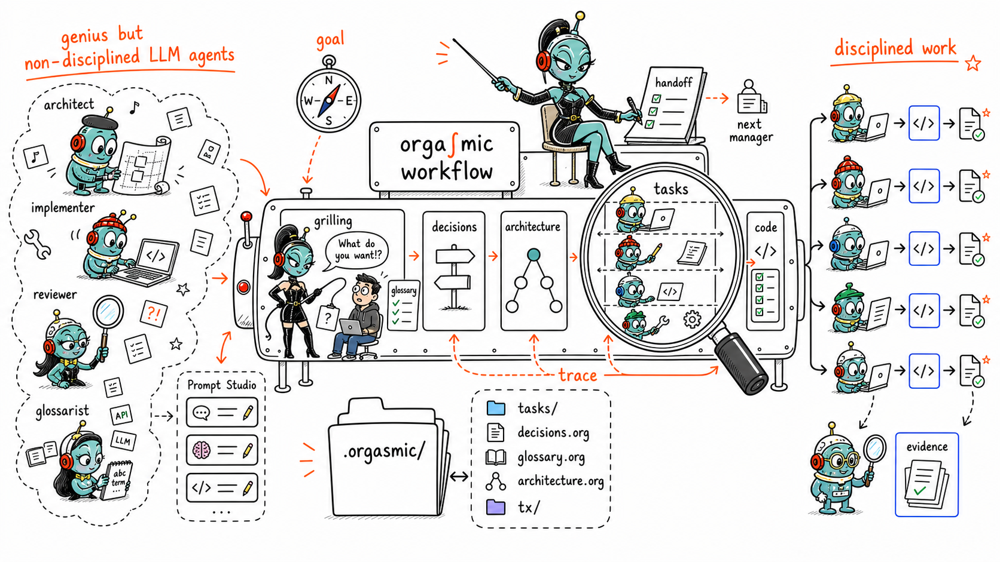

# orga∫mic

> Disclaimer: NSFW!
> Naturally Suitable For Work :)



orgasmic makes AI-agent work durable, reviewable, and repo-native.

> Grilling -> Decisions+Glossary -> Architecture -> Tasks -> Code -> Repeat.

All live next to the code and version with it.

For developers and teams who want agents to work inside real repositories with
durable state, explicit decisions, and reviewable execution history.

> Work in progress: the skill-first workflow, CLI/runtime, daemon-served UI, and
> manager/worker coordination are usable today, but packaging and polish are still evolving.

## Main Features

- [Org-mode](https://en.wikipedia.org/wiki/Org-mode) **native for agents** - `.org` is plain text with a structure LLMs
already understand well: headings, properties, TODO states, and tags. Agents can orient in `.orgasmic/` without a custom database viewer or
schema tutorial.
- **Local-first project state and task tracking** - `.orgasmic/` keeps decisions,architecture, glossary, tasks, handoff, goal, and agents run history next to the code. Project coordination can be reviewed, diffed,
branched, and committed.
- **Agent and harness agnostic** - Bring Claude, Codex, Cursor, Hermes, local
models; assign each to the work it is best suited
for: orchestration, implementation, review, planning, architecture. Prompt Studio lets you inspect and edit the exact initial prompt each
specialized worker receives.
- **Disciplined spec-to-code framework** — inspired by Matt Pocock's "grilling-with-docs" approach and domain-driven software design principles, a typed pipeline from intent to code: griller agent stress-tests assumptions into `decisions.org` and `glossary.org`, architector authors the architecture graph (source paths,
typed edges, per-node test gates), planner agent turns accepted design into bounded
tasks, and implementer agents change code inside declared read/write scope and
acceptance criteria. The manager dispatches these agents with prompts compiled from specs and closes every landing with an adversarial reviewer.
- **UI, browser, app, remote, and mobile access** — Install orgasmic once, then
adopt each repository explicitly with `/orgasmic init`. Try the desktop app,
connect to a remote daemon, or use Android app for mobile access.

## Install

### 1. Install orgasmic once
In a terminal:

Install the latest stable release:
```bash
curl -fsSL https://raw.githubusercontent.com/theaspirational/orgasmic/main/scripts/install.sh | bash
```

Install the latest nightly build (new features, bug fixes, and breaking changes):
```bash
curl -fsSL https://raw.githubusercontent.com/theaspirational/orgasmic/main/scripts/install.sh | bash -s -- --channel nightly
```

The installer creates `~/.orgasmic`, unpacks orgasmic runtime under
`~/.orgasmic/runtimes/`, links orgasmic CLI tool at `~/.orgasmic/bin/orgasmic`, and links the shipped
`/orgasmic` skill into `~/.agents/skills/orgasmic`.

Agents that read the shared `~/.agents/skills/` path discover `/orgasmic`
automatically. If yours keeps skills somewhere else (Claude, Codex, Hermes, …), paste this to your agent and let it wire the skill into that
harness:

```md
Make the orgasmic skill available to you as the `/orgasmic` command. It is
installed at `~/.agents/skills/orgasmic` — a folder containing `SKILL.md`.
Symlink it (preferred, so future updates flow automatically) — or copy it if
symlinks aren't supported — into whatever skills directory this agent
discovers, e.g. `~/.claude/skills/orgasmic`.
```

To pick up new releases later, run:

```text
/orgasmic update
```

### 2. Open the UI

```bash
orgasmic ui
```

This mints a one-time launch URL and opens the daemon-hosted web UI in your
browser, auto-starting the local daemon if it isn't already running. To get the
URL without opening a browser (e.g. on a headless host, or to open it on another
device), use:

```bash
orgasmic ui --print-url
```

If `orgasmic` isn't yet on your `PATH` in the current shell, call it by its
installed path or open a new terminal:

```bash
~/.orgasmic/bin/orgasmic ui
```

The daemon listens on `127.0.0.1:4848` by default, but you can't just browse to
that address — the UI is auth-gated. `orgasmic ui` mints a one-time URL that
plants a session cookie; after opening it once, `http://localhost:4848` works
directly in that same browser until the session expires.

If the UI ever asks for a token directly, it's the bearer token created when the
daemon first starts, stored at `~/.orgasmic/user/auth/token`:

```bash
cat ~/.orgasmic/user/auth/token
```

(`orgasmic auth show` confirms the token file's location, but prints only its
path and size — not the value; use `cat` to read the token itself.)

### 3. Adopt a repository

Open your coding agent in the repository you want orgasmic to manage:

```bash
cd ~/code/my-project
```

Then ask the agent:

```text
/orgasmic init
```

Once a repository is adopted, it appears in the UI's board so you can review and
drive its agents from there.

That creates `.orgasmic/` in that repository, then asks whether to start the
bootstrap pass now or leave it for `/orgasmic resume`.

The regular install can coexist with a cloned repo on the same machine. The
clone is just source code; the installed runtime lives under `~/.orgasmic`.
If you fork or clone orgasmic to work on a feature, keep the bundle install and
temporarily point only the daemon at your local build:

```bash
git clone https://github.com/theaspirational/orgasmic (or your fork)
cd orgasmic
git switch -c feature/my-change
orgasmic project add "$PWD"
orgasmic daemon restart --from-source "$PWD"
```

`--from-source` builds `cargo build --release`, resolves the newest
`target/release/orgasmic` or `target/<triple>/release/orgasmic`, rewrites the
local daemon service to that exact binary, and leaves `install.json` in bundle
mode. A later `orgasmic update` clears this daemon runtime override and
restarts on the updated vendor runtime. Use `--no-build` only when you already
built the release binary yourself.

Contributor source install is separate and explicit. Use it only when you want
`orgasmic update` itself to pull and rebuild a checkout instead of updating
runtime bundles:

```bash
git clone https://github.com/theaspirational/orgasmic (or your fork)
cd orgasmic
bash scripts/install.sh --from-source "$PWD"
```


### Local daemon lifecycle

`orgasmic serve` is the foreground debug command. Normal daemon-backed CLI
commands auto-start the local daemon when `ORGASMIC_DAEMON_URL` is not set, and
`orgasmic daemon start|stop|restart|status` owns that same local lifecycle.
The lifecycle adapter is user-owned and platform native where available:

- macOS writes and loads a user LaunchAgent at
  `~/Library/LaunchAgents/orgasmic.daemon.plist`.
- Linux writes a `systemd --user` unit under the normal user systemd config
  directory when the user manager is available; otherwise it reports an
  explicit detached-process fallback for the current session.
- Windows uses a non-admin per-user Scheduled Task with least-privilege logon
  ownership.

`orgasmic daemon status` reports the selected adapter plus whether persistence is
installed/enabled. If `ORGASMIC_DAEMON_URL` is set, the target is externally
owned and the CLI does not start, stop, or install a local service for it.
Controlled restarts are recovery-aware: `orgasmic restart` / `orgasmic daemon
restart` drains the daemon, restarts the service, reattaches live mux-backed
runs when possible, and leaves non-reattachable runs visible through
`orgasmic run list` / `orgasmic recovery status`. Do not restart just to clear
a stale dispatch lease; use `orgasmic manager lease-release`.

P.S. If a repository already has `.orgasmic/`, use `/orgasmic recall` to inspect
the current state or `/orgasmic resume` to continue the next handoff action.

## More

- Contributor setup: [CONTRIBUTING.md](CONTRIBUTING.md)
- Skill entry point: [shipped/skills/orgasmic/SKILL.md](shipped/skills/orgasmic/SKILL.md)
- Install wizard details: [shipped/skills/orgasmic/references/install.md](shipped/skills/orgasmic/references/install.md)
